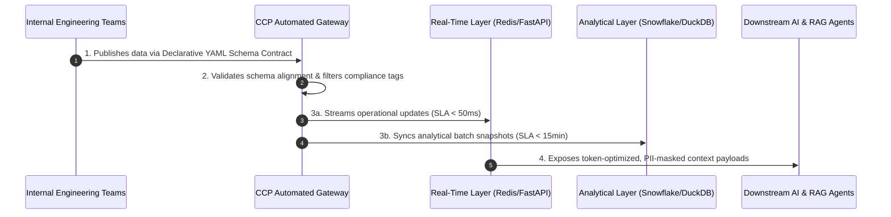

# core-customer-profile
Internal customer data platform specification designed for self-service data ingestion, multi-tenant SLAs, and token-optimized context streams for generative AI applications.

# Core Customer Profile Platform (CCP)

## Product Vision
The Core Customer Profile Platform (CCP) is an internal platform designed to unify scattered user events into a single, real-time authoritative profile engine. CCP eliminates internal developer friction through self-service ingestion standards, enforces infrastructure-level data privacy compliance, and delivers token-optimized data payloads directly into downstream generative AI context retrieval workflows.

## Product Roadmap
### Quarter 1: Ingestion Automation & Core Compliance
* **Self-Service Automated Pathways:** Deliver declarative configuration standards to eliminate manual schema coordination and accelerate data onboarding velocity.
* **Infrastructure-Level Guardrails:** Enforce automated data classification and compliance tracking directly at the ingestion gateway.

### Quarter 2: Downstream AI Enablement & Optimization
* **Structured RAG Context Engines:** Launch high-throughput, low-latency API payloads formatted explicitly for Large Language Model context injection.
* **Legacy Lifecycle Management:** Initiate a structured deprecation framework for legacy manual pipelines to minimize corporate technical debt.

## System Flow Architecture

## ⚖️ Strategic Product Decisions & Core Architectural Trade-offs

Building enterprise platform infrastructure requires making deliberate trade-offs to protect customer experience. As the Product Lead, I implemented the following strategic mandates:

1. **Eventual Consistency vs. Real-Time Performance:** To achieve sub-50ms query speeds for downstream AI customer agents, the Real-Time Cache layer handles data with *eventual consistency*. The complete operational reconciliation occurs in the analytical warehouse within a 15-minute SLA. This ensures heavy business intelligence reporting workloads never degrade active consumer-facing chatbots.
2. **Infrastructure-Enforced Privacy vs. Flexible Downstream Mapping:** Compliance is embedded straight into the ingestion network via data contracts rather than expecting third-party apps to parse data cleanly. pay-loads default to SHA256 masking for PII if a user drops their consent state, shifting security left in the development lifecycle.

---

## 🚦 Risk Management & Threat Matrix

Platform changes can introduce friction for developer teams. This matrix tracks our primary rollout risks and engineering mitigations:

| Risk Identified | Critical Probability | Business & Technical Impact | PM Mitigation Strategy |
| :--- | :--- | :--- | :--- |
| Upstream internal teams resist migrating to new Data Contracts due to competing sprint deadlines. | High | Delays sunsetting legacy architecture, inflating maintenance overhead. | The automated gateway reduces individual pipeline configuration time from 4 weeks to < 1 hour, providing an immediate developer velocity incentive to switch. |
| An upstream breaking schema deployment alters a critical field, threatening downstream RAG model failures. | Medium | Severe; could cause downstream AI systems to hallucinate or misrepresent customer states. | The Automated Gateway blocks structural pipeline builds inside the CI/CD pipeline immediately if incoming data fails declarative configuration assertions, preventing bad data from ever hitting production. |

---

## 📈 Platform Adoption & Lifecycle Transition Strategy

A technical platform product is only successful if it achieves absolute developer adoption and eliminates redundant legacy technical debt. 

### Multi-Phase Onboarding Plan
* **Phase 1 (Alpha):** Roll out the self-service ingestion engine to exactly two close internal data producer teams to monitor system edge cases and gateway validation errors.
* **Phase 2 (Beta):** Open onboarding access to the top 10 high-volume enterprise event streams. 
* **Phase 3 (General Availability):** Launch full production scale and implement the formal legacy pipeline deprecation framework.

### Legacy Pipeline Deprecation Policy
To permanently remove expensive legacy system maintenance and shift 100% of data traffic through the standardized, compliant gateway:
1. **T-Minus 90 Days:** Issue a formal deprecation notice to all engineering organization stakeholders detailing endpoint phase-outs.
2. **T-Minus 60 Days:** Institute mandatory 1-hour service "Brownouts" (scheduled platform processing breaks) during low-traffic windows to explicitly force hidden dependencies to surface.
3. **T-Minus 30 Days:** Revoke write permissions to old backend tables, routing remaining system dependencies exclusively through the automated profile gateway.
