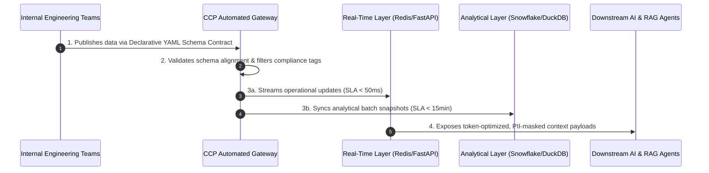

# core-customer-profile
Internal customer data platform specification designed for self-service data ingestion, multi-tenant SLAs, and token-optimized context streams for generative AI applications.

# Core Customer Profile Platform (CCP)

## Product Vision
The Core Customer Profile Platform (CCP) is an internal platform designed to unify scattered user events into a single, real-time authoritative profile engine. CCP eliminates internal developer friction through self-service ingestion standards, enforces infrastructure-level data privacy compliance, and delivers token-optimized data payloads directly into downstream generative AI context retrieval workflows.

## Product Roadmap
### Quarter 1: Ingestion Automation & Core Compliance
* **Self-Service Automated Pathways:** Deliver declarative configuration standards to eliminate manual schema coordination and accelerate data onboarding velocity.
* **Infrastructure-Level Guardrails:** Enforce automated data classification and compliance tracking directly at the ingestion gateway.

### Quarter 2: Downstream AI Enablement & Optimization
* **Structured RAG Context Engines:** Launch high-throughput, low-latency API payloads formatted explicitly for Large Language Model context injection.
* **Legacy Lifecycle Management:** Initiate a structured deprecation framework for legacy manual pipelines to minimize corporate technical debt.

## System Flow Architecture

